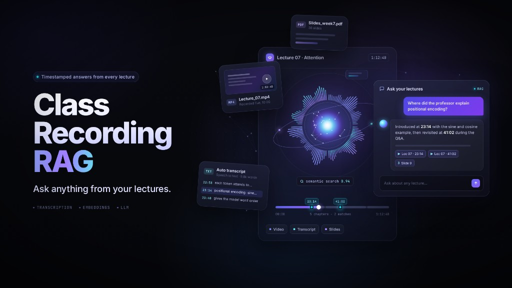

# RAG Class Recordings



Ask questions about your class recordings and get answers that cite the exact
lecture moments they came from. Every claim in an answer is linked to a
timestamped transcript excerpt, so you can jump straight back to where the
instructor explained it.

## Features

- **Timestamped citations** — answers carry `[SOURCE_N]` markers that map to
  the module, class, and time range of the supporting transcript chunk.
- **Hybrid retrieval** — pgvector semantic search and Postgres full-text search
  run side by side and are merged with Reciprocal Rank Fusion.
- **Query planning** — follow-up questions are rewritten into standalone
  queries, and complex questions are expanded into step-back and sub-queries.
- **Evidence judging** — a separate LLM step decides whether the retrieved
  evidence is sufficient, partial, insufficient, or conflicting, and the answer
  style adapts to that verdict.
- **Citation validation** — fabricated source ids are detected and the answer
  is regenerated once; invalid markers are stripped rather than shown.
- **Honest fallback** — when the course doesn't cover a topic, the answer says
  so and can add a clearly marked general-knowledge section.
- **Conversation threads** — chat history is persisted per user and cohort.
- **Durable ingestion** — `.srt` / `.vtt` transcripts are parsed, chunked,
  and embedded by retryable Inngest background jobs.
- **Evaluation harness** — Recall@K, MRR, nDCG, and answerability metrics over a
  hand-labelled question set.

## Tech stack

| Layer | Technology |
| --- | --- |
| Runtime and tooling | [Bun](https://bun.com) workspaces, TypeScript |
| API | Express 5, Zod validation |
| Database | PostgreSQL 17 + pgvector (HNSW index), Drizzle ORM |
| Background jobs | [Inngest](https://www.inngest.com) |
| Models | OpenAI chat models and `text-embedding-3-small` |
| Frontend | React + Tailwind CSS, served by Bun |

## Project structure

```text
apps/
  api/                  Backend service
    src/
      http/             Express routes, middleware, request validation
      rag/              Chat pipeline: contextualizer, planner, retrieval,
                        fusion, context builder, judge, answer generation
      ingestion/        Transcript parsing, sentence rebuilding, chunking
      inngest/          Durable ingest and reindex jobs
      providers/        OpenAI LLM + embedding providers (and test mocks)
      db/               Drizzle schema and repositories
      config/           Environment schema and derived RAG config
    migrations/         SQL migrations
    scripts/            Seeding and chunk-inspection CLIs
    evals/              Retrieval and answer-quality evaluation harness
  web/                  Chat UI with an evidence rail and source viewer
packages/
  shared/               Request/response contracts shared by API and web
docker/initdb/          Database init scripts (creates the rag_test database)
tests/                  Unit and integration tests
```

## How it works

### Ingestion

1. A transcript file (`.srt` or `.vtt`) is registered, either by the seed
   script or by uploading it through the API.
2. A `transcript.ingest.requested` event starts the Inngest `ingest-transcript`
   job.
3. The job checks the file's hash against the database, parses the cues, and
   strips tags and speaker labels.
4. Cues are joined back into full sentences that keep their original
   timestamps.
5. Sentences are grouped into overlapping chunks of about 500 tokens. Each chunk
   gets a deterministic key, so re-running ingestion is idempotent.
6. Chunks are stored, then embedded in batches.

### Answering a question

```text
question
  → contextualize   rewrite follow-ups into a standalone query
  → plan            add rewritten / step-back / sub-queries
  → retrieve        vector + keyword search per query, scoped to the cohort
  → fuse            Reciprocal Rank Fusion across every ranked list
  → build context   hydrate, order, and token-budget the [SOURCE_N] excerpts
  → judge           sufficient | partial | insufficient | conflicting
  → generate        verdict-specific prompt, cite every claim
  → validate        reject fabricated citations, regenerate once
  → persist         save the turn and return the answer with its sources
```

The system prompts live in `apps/api/src/rag/contextualizer.ts`,
`apps/api/src/rag/planner.ts`, `apps/api/src/rag/evidence/judge.ts`, and
`apps/api/src/rag/generation/prompts.ts`.

## Prerequisites

- [Bun](https://bun.com) 1.3 or newer
- Docker Desktop, for the local PostgreSQL + pgvector database
- An OpenAI API key

## Setup

Install the workspace dependencies:

```bash
bun install
```

Create your environment file and fill in at least `OPENAI_API_KEY`,
`DATABASE_URL`, and `PUBLIC_COHORT_ID`:

```bash
cp .env.example .env
```

## Start the project

If your database is already populated and chunked, you don't need to run
migrations, seeding, or ingestion to start the project. For a fresh database,
see [Loading transcripts](#loading-transcripts) first.

1. Start PostgreSQL:

   ```bash
   docker compose up -d postgres
   ```

2. Start the API in a separate terminal:

   ```bash
   bun run dev:api
   ```

3. Start the frontend in another terminal:

   ```bash
   bun run dev:web
   ```

4. Open [http://localhost:5173](http://localhost:5173).

The API runs at `http://localhost:3000` by default. You can change the ports
with `PORT` and `WEB_PORT` in `.env`. If you do, update `PUBLIC_API_BASE_URL`
and `CORS_ALLOWED_ORIGINS` to match.

## Verify the services

Check that the API is up:

```bash
curl http://localhost:3000/health
```

Check that the database and pgvector are ready:

```bash
curl http://localhost:3000/ready
```

A ready installation returns `{"status":"ready","database":true,"pgvector":true}`.

## Loading transcripts

Only needed for a fresh database or when adding recordings.

1. Apply the database migrations:

   ```bash
   bun run migrate
   ```

2. Put transcripts under `recordings/class-subtitle/<module>/<class>/` as
   `.srt` or `.vtt` files. If a class has both, the `.srt` file is used. Numeric
   prefixes or suffixes in folder names (`01_intro`, `module 10`) set the
   ordering.

3. Build the seed manifest from the folder tree:

   ```bash
   bun run seed:manifest
   ```

4. Start the Inngest dev server with the API running, so the ingestion jobs can
   execute:

   ```bash
   bunx inngest-cli dev -u http://localhost:3000/api/inngest
   ```

5. Seed the cohort, modules, classes, and transcripts, and queue ingestion:

   ```bash
   bun run seed:transcripts
   ```

   Pass `--dry-run` to write the database rows without sending ingestion
   events.

6. Set `PUBLIC_COHORT_ID` in `.env` to the id of the created `react-native`
   cohort.

To check how a single file will be chunked, without touching the database or
OpenAI:

```bash
bun run inspect:chunks -- samples/sample.vtt
```

## API

Chat endpoints read the user and cohort from the `x-user-id` and `x-cohort-id`
headers. These are placeholders for local development and are not
authenticated.

| Method | Path | Purpose |
| --- | --- | --- |
| `GET` | `/health` | API liveness |
| `GET` | `/ready` | Database and pgvector readiness |
| `POST` | `/api/chat` | Ask a question; returns the answer, grounding status, and sources |
| `GET` | `/api/conversations` | List the current user's conversations |
| `GET` | `/api/conversations/:id` | Get one conversation with its messages |
| `GET` | `/api/cohorts/:cohortId/catalog` | List the cohort's modules and classes |
| `POST` | `/api/transcripts` | Upload a transcript file for a class (multipart, `file` + `classId`) |
| `GET` | `/api/transcripts/:id` | Check a transcript's ingestion status |
| `*` | `/api/inngest` | Inngest serve handler |

## Configuration

All settings are validated at startup, and the API won't start if any are
invalid. `.env.example` documents every variable. The ones you're most likely
to change:

| Variable | Default | What it controls |
| --- | --- | --- |
| `LLM_MODEL` | see `.env.example` | Chat model used for every LLM stage |
| `LLM_REASONING_EFFORT_*` | `low` / `medium` | Reasoning effort per stage (contextualizer, planner, judge, answer) |
| `EMBEDDING_MODEL` | `text-embedding-3-small` | Embedding model; must match `EMBEDDING_DIMENSIONS` |
| `CHUNK_TARGET_TOKENS` | `500` | Target chunk size, bounded by `CHUNK_MIN_TOKENS` / `CHUNK_MAX_TOKENS` |
| `RETRIEVAL_TOP_K_VECTOR` / `_KEYWORD` | `10` | Candidates per query from each retriever |
| `CONTEXT_TOKEN_BUDGET` | `8000` | Token budget for evidence passed to the answer model |
| `ALLOW_GENERAL_KNOWLEDGE_FALLBACK` | `true` | Allow a marked general-knowledge section when the course has no coverage |
| `DIAGNOSTICS_ENABLED` | `false` | Include pipeline diagnostics in chat responses |

Only variables prefixed with `PUBLIC_` are included in the frontend bundle, so
never put a secret behind a `PUBLIC_` name.

## Testing and evaluation

```bash
bun test          # Unit and integration tests
bun run eval      # Run the eval set against the real pipeline
```

Integration tests use `TEST_DATABASE_URL`; unset it to skip them. The eval run
needs a seeded database and a valid `OPENAI_API_KEY`, and writes its report to
`apps/api/evals/results/`.
